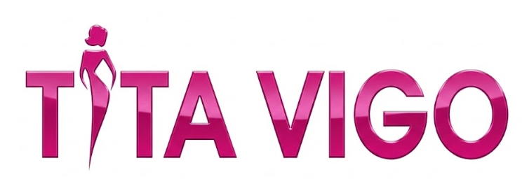

# Tita Vigo - E-commerce de Joyas

## Descripción

**Tita Vigo** es un e-commerce de joyas enfocado en el mercado peruano. Ofrece un modelo híbrido de ventas:
- **Joyas en stock**: Piezas ya adquiridas de proveedores (AliExpress + locales) listas para envío inmediato
- **Venta contra-demanda**: Catálogo extendido donde el cliente pide y se adquiere específicamente para él

La experiencia es personal y cercana, con WhatsApp como canal principal de comunicación.

---

## Usuario Target

### Comprador Primario
- **Mujeres 25-45 años** en Perú (Lima principalmente)
- Buscan joyas accesibles pero con diseño elegante
- Prefieren atención personalizada por WhatsApp
- Compran para uso propio o regalo

### Comprador Secundario
- **Hombres 25-50** buscando regalos
- Necesitan orientación en la compra
- Valoran respuesta rápida y opciones claras

---

## Propuesta de Valor

| vs Competencia | Tita Vigo |
|----------------|-----------|
| Tiendas físicas (caro) | Precios accesibles, mismo estilo premium |
| AliExpress directo (demora) | Inventario local = entrega rápida |
| Otros e-commerce (impersonal) | Atención directa por WhatsApp |
| Bazares (inconsistente) | Catálogo curado, calidad verificada |

### Frase de Posicionamiento
> "Joyas elegantes al alcance de todos, con la atención que mereces"

---

## Identidad Visual

- **Colores primarios**: Pink/Magenta (#E91E8C) + Blanco
- **Estilo**: Femenino, elegante, moderno
- **Tipografía**: Sans-serif bold, feeling premium
- **Tono**: Cercano pero profesional

---

## Fecha
2026-01-27
